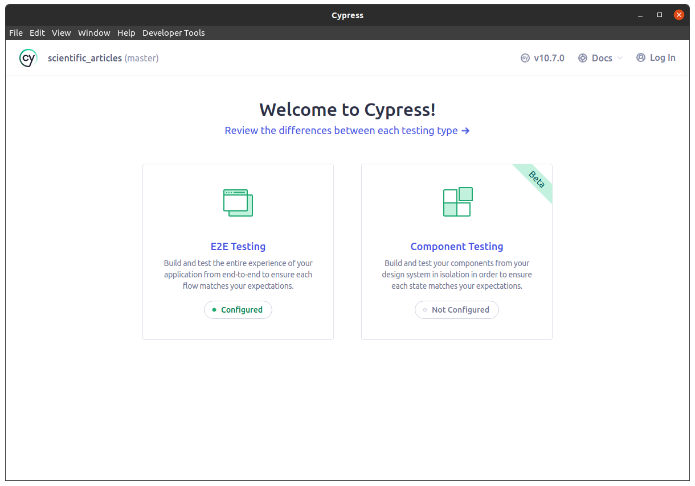
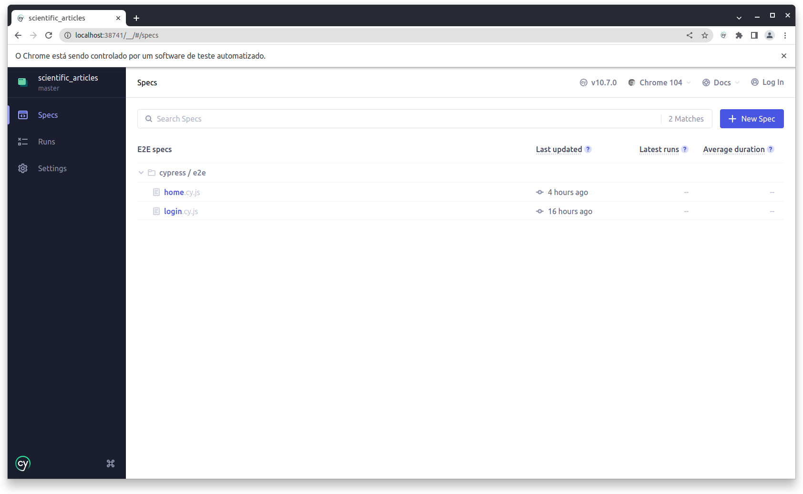
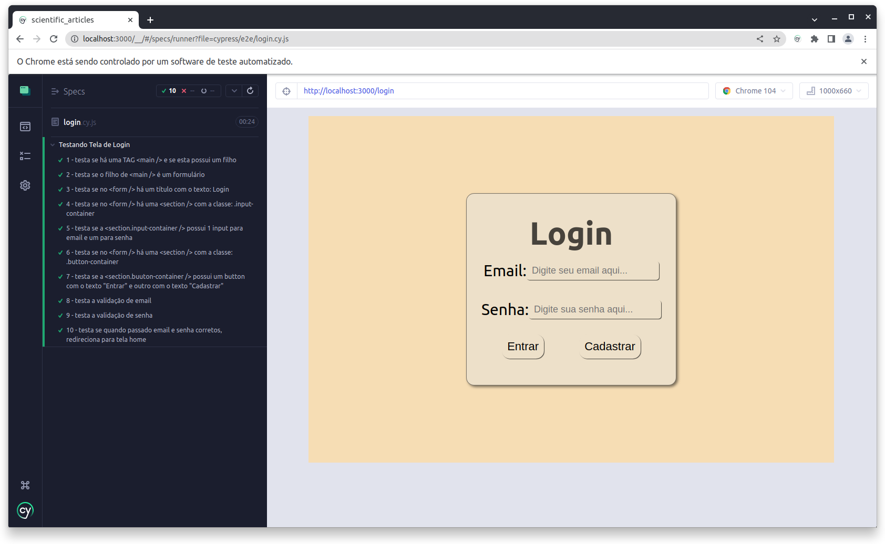

# Projeto Recebido pela Mettzer - Artigos Científiocs - Front-end

### Sumário

1. [Sobre o Projeto](#sobre-o-projeto)
   - [Padrões de Projeto](#padrões-de-projeto)tá s
   - [Tecnologias Utilizadas](#tecnologias-utilizadas)
2. [Como Rodar o Projeto Em Sua Máquina](#como-rodar-o-projeto-em-sua-máquina)
   - [Pré Requisitos](#pré-requisitos)
   - [Clonando o Projeto](#clonando-o-projeto)
   - [Instalando Dependências](#instalando-dependências)
   - [Rodando o Projeto](#rodando-o-projeto)
3. [Como Rodar os Testes em sua Máquina](#como-rodar-os-testes-em-sua-máquina)
   - [Rodando os Testes](#rodando-os-testes)
4. [Telas do Projeto](#telas-do-projeto)
   - [Tela /login](#tela-login)
5. [Considerações Finais](#considerações-finais)

---

## Sobre o Projeto
O Projeto __Artigos Científicos - Front-end__ é uma aplicação que consome a API <a href='https://core.ac.uk/services/api'>CORE</a> buscando _Artigos Científicos_. <br>
Você pode conferir uma documentação breve <a href='https://core.ac.uk/docs/'>aqui</a>

#### Padrões de Projeto
Busquei, ao máximo, seguir alguns dos conceitos de *__SOLID__* tentando colocar em prática as ideia de __Single Responsibility Principle__, __Open/Closed Principle__ e __Dependency Inversion Principle__.

#### Tecnologias Utilizadas
Para este projeto eu utilizei as seguintes tecnologias:

- JavaScript (ES6)
- ReactJS
- React Hooks
- ContextAPI

Usei também a biblioteca:

- react-router-dom

Para qualidade de código foi usado:

- eslint-config-trybe-frontend
- stylelint
- stylelint-config-standard
- stylelint-order
- cypress

---

## Como Rodar o Projeto Em Sua Máquina

#### Pré Requisitos
Primeiro, será necessário que você tenha instalado o Git e o Node (NPM). Caso não tenha e precise de uma força, siga os tutoriais dos links abaixo.

<a href="https://git-scm.com/book/pt-br/v2/Come%C3%A7ando-Instalando-o-Git">Tutorial do Git</a> <br/>
<a href="https://balta.io/blog/node-npm-instalacao-configuracao-e-primeiros-passos">Tutorial do Node</a> <br/>

#### Clonando o Projeto
Com o ambiente preparado, agora é preciso que você clone o projeto para sua máquina. <br/>

1. Dentro do repositório no GitHub, clique no botão ***`Code`*** (O único botão verde na tela).
2. Em seguida, copie o link do repositório.
3. Depois, abra o seu terminal, navegue até a pasta que deseja colocar o projeto e use o comando: 
```
git clone git@github.com:Edi-Santos/mettzer-case_scientific-articles-frontend.git
```

#### Instalando Dependências
Com o projeto já clonado, através do seu terminal ainda aberto, entre na pasta raiz do projeto e rode o comando: <br/>
```
npm install
```
Assim serão instaladas todas as dependências necessárias para que se possa rodar o projeto.

#### Rodando o Projeto
Para rodar o projeto use o comando:
```
npm start
```

---

## Como Rodar os Testes em sua Máquina
Para a elaboração dos testes deste projeto foi utilizada a ferramenta *__Cypress__*. Esta é uma poderosa ferramento para criação de _testes automatizados_ tanto _E2E_ quanto testes de componentes.

#### Rodando os Testes
Para começar a testar você, com seu terminal aberto na raiz do projeto, execute:

>*__Obs.__*: O teste acessa a URL do localhost. Para poder rodar os testes é necessário que você esta com o projeto rodando como informado na seção: [Rodando o Projeto](#rodando-o-projeto)

```
npm run test:cy
```
Aguarde um momento! O Cypress será iniciado (paciência... às vezes demora um pouco mesmo :grimacing:).

Após a inicialização do Cypress abrirá as seguinte tela:

> <br>

Escolha a opção `E2E Testing`, pois é esta que está configurada e com testes feitos. <br>
Em seguida, abrirá a seguinte tela:

> <br>

Escolha alguma das 3 opções. A que você escolher será onde abrirá os testes do _Cypress_.
Após selecionar a opção e clicar em `Start E2E Testing in ...`, abrirá a seguinte tela:

> <br>

>__Obs__: Estarei utilizando a opção _Chrome_.

Veja que temos 2 arquivos de testes. Escolha um arquivo de teste para que o _Cypress_ abra-o e execute-o.

> <br>

A tela mostrada acima é a tela que abrirá executando todos os testes presentes no arquivo *__login.cy.js__*

---

## Telas do Projeto
Neste projeto há 2 telas (tela de _login_ e _home_) e uma que não foi desenvolvida (tela de _cadastro_).

#### Tela /login
Esta tela possui dois _inputs_ sendo um para _email_ e outro para _senha_. Possui também dois botões que redirecionam para outra tela que são o botão __Entrar__ e __Cadastrar__. <br>
O botão `Entrar` pega o email usado no _login_ e guarda no _Local Storage_ para reutilizar no `<header />` presente na tela seguinte.

Há ainda uma pequena validação que verifica se o email é um email válido e se a senha possui, pelo menos, 6 dígitos.

Tela de Login:
>

---

## Considerações Finais
Aqui eu encerro esta documentação. Espero que tenha ficado o mais claro, o mais nítido possível e que não tenha passado nenhuma etapa despercebida por mim.

Muito obrigado por ter conferido este projeto!! <br/>
Abraços!
